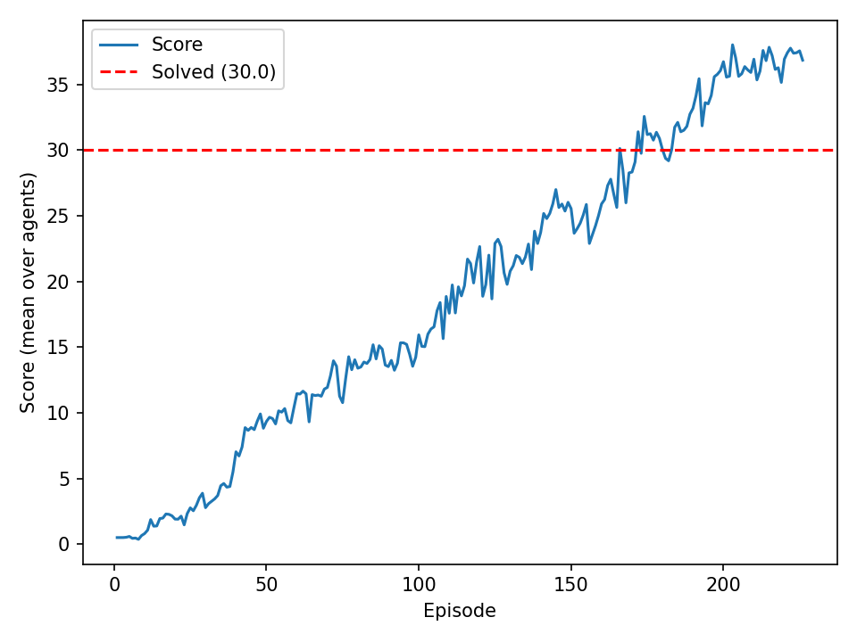

# Report — DDPG for Continuous Control (Reacher)

## 1. Environment
The Unity Reacher environment provides:
- **State**: 33-dimensional continuous vector (positions, rotations, velocities, angular velocities).
- **Action**: 4-dimensional continuous vector in **[-1, 1]**.
- **Reward**: +0.1 per step when the agent's hand is in the goal region.
- **Goal**: Achieve an average score >= **30** over **100** consecutive episodes (Udacity criterion).

> Replace this line with your run info:  
> **Solved at episode:** `XXX` (Average(100) = `YY.YY`)

## 2. Algorithm (DDPG)
We use **Deep Deterministic Policy Gradient (DDPG)**:
- **Actor** \(\mu_\theta(s)\): deterministic policy mapping states to continuous actions.
- **Critic** \(Q_\phi(s,a)\): estimates the action-value function.
- **Replay buffer** for off-policy learning.
- **Target networks** \(\mu_{\theta'}\) and \(Q_{\phi'}\) with **soft updates** to stabilize training.
- **Ornstein–Uhlenbeck (OU) noise** added to actions during training for exploration.

### Target for critic
\[
y = r + \gamma\, Q_{\phi'}(s', \mu_{\theta'}(s'))\,(1-d)
\]
Critic minimizes MSE between \(Q_\phi(s,a)\) and \(y\).  
Actor maximizes \(Q_\phi(s, \mu_\theta(s))\).

## 3. Network Architectures
From `model.py`:
- **Actor**: FC(33 → 400) → ReLU → FC(400 → 300) → ReLU → FC(300 → 4) → Tanh
- **Critic**:
  - State path: FC(33 → 400) → ReLU
  - Concat action: [400 + 4] → FC(404 → 300) → ReLU → FC(300 → 1)

## 4. Hyperparameters
From `DDPGConfig` in `ddpg_agent.py`:
- Replay buffer size: 1e6  
- Batch size: 256  
- Discount \(\gamma\): 0.99  
- Soft update \(\tau\): 1e-3  
- Actor LR: 1e-4  
- Critic LR: 1e-3  
- Weight decay: 0.0  
- Learn every: 20 steps  
- Learn updates per learn: 10  
- OU noise: \(\theta=0.15\), \(\sigma=0.20\)  
- Critic grad clip: 1.0  

## 5. Results
Include the learning curve plot here (generated by `train.py` as `scores.png`):

Describe briefly:
- Training reached the Udacity threshold (Average score >= 30 over 100 episodes).
- Provide the episode count where the environment was solved.

## 6. Future Work
Concrete ideas:
1. **Twin Delayed DDPG (TD3)**: reduce overestimation bias and improve stability.
2. **Soft Actor-Critic (SAC)**: typically more stable for continuous control tasks.
3. **Prioritized Experience Replay**: sample more informative transitions.
4. **Parameter noise** or scheduled exploration noise to improve exploration.
5. Hyperparameter tuning: update frequency, noise schedule, actor/critic sizes.
